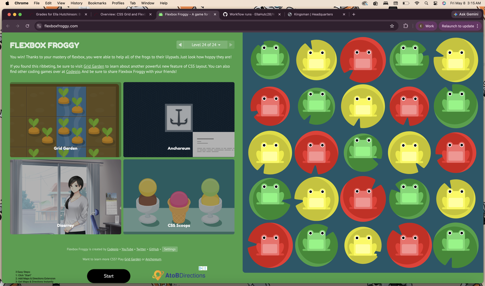
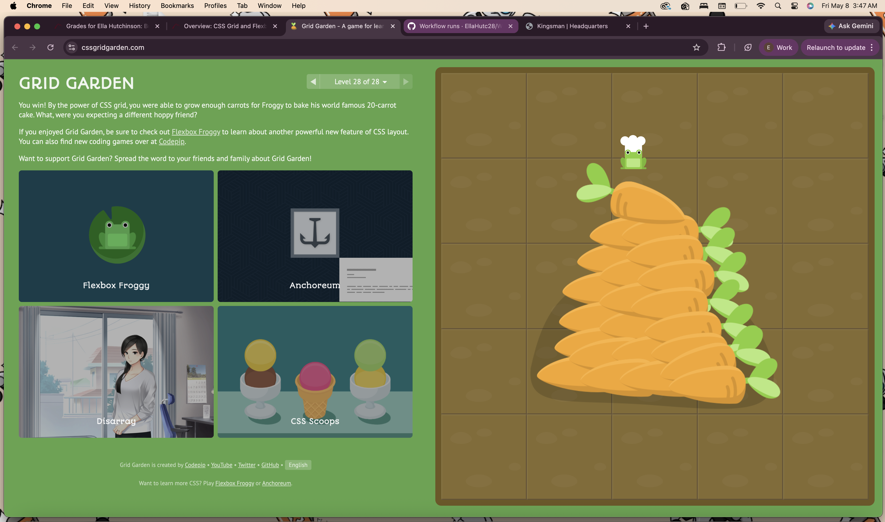

Side note, i couldn't figure out how to put an image in "README.md" so i looked it up and this was the solution I found... hopefully it works.

This week went quite well, I feel like im getting more proficient as I do this. I'm doing fairly okay in general, I believe i've made a ton of progress!

I feel fairly confident working with Flexboxx and CSS. CSS Grid is still getting there but not bad either. As usual I feel like the more practice I get with it, the more confident i'll get.